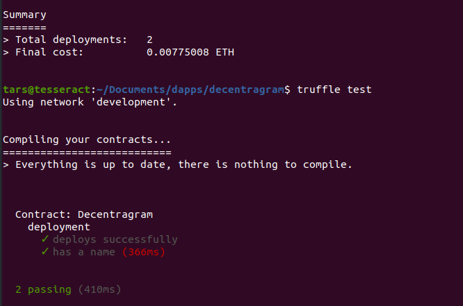
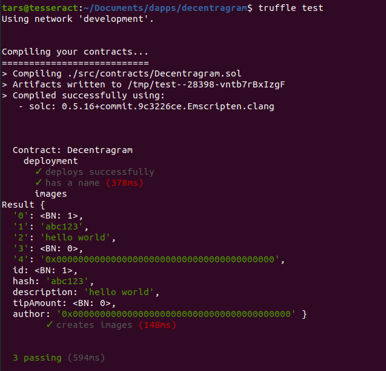
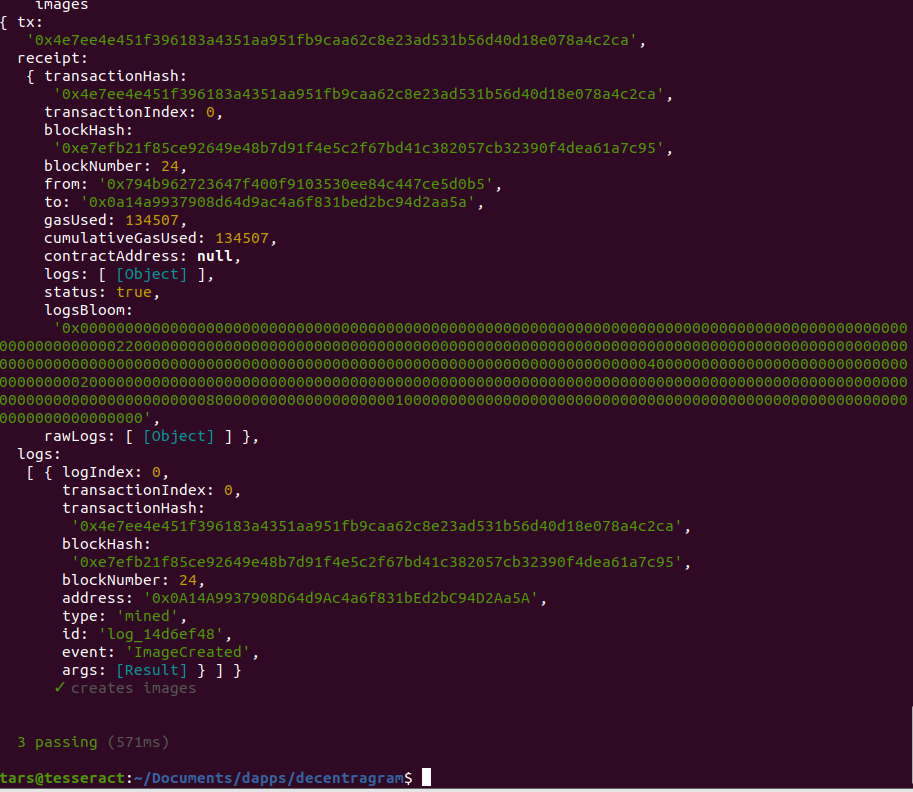
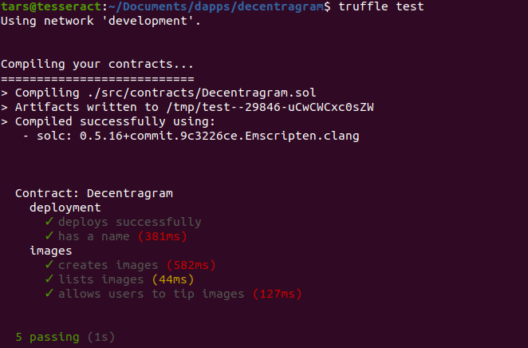

# Decentralized Instagram

NOTE: I'm using a 20.04.1-Ubuntu

<u>**Dependencies**</u>:

- NodeJs & NPM

  ```bash
  sudo apt install nodejs
  sudo apt install npm
  ```

- Truffle framework (building ethereum smart contracts, etc.)

  ```bash
  npm install --g truffle@5.4.1
  ```

- Ganache (private test blockchain w/o using real crypto)

  ```bash
  Navigate to https://www.trufflesuite.com/ganache and download the appimage
  
  chmod +x ganache-2.5.4-linux-x86_64.AppImage
  ```

- Metamask

  ```
  Install from Google Chrome store
  ```

- Clone dapp univ's starter code

  ```bash
  git clone -b starter-code https://github.com/dappuniversity/decentragram decentragram
  
  cd decentragram
  
  #install
  npm install
  ```


### Table of Contents:

[Front End Dev](#Frontend-Web-Client-development)

[End Product](#finished-page)


### Backend Smart Contract Development

**<u>Creating the Smart Contracts:</u>**

```javascript
//Navigate to decentragram.sol and add in 
string public name = "Decentragram";
```


**<u>Create migration and deploy contract on ganache</u>**

```javascript
//navigate to deploy_contracts.js and add in
deployer.deploy(Migrations);
```

```bash
#migrate
truffle migrate --reset

#truffle console to interact with the development blockchain 
truffle console
#fetch decentragram from blockchain and assign it to variable, asynchronus with await
> decentragram = await Decentragram.deployed()
#see JS version of smart contract
> decentragram
> decentragram.address
> name = await decentragram.name()
> name
```

**<u>Tests:</u>**

Get the mocha, chai assertion library. Mocha comes with truffle, get chai by

```bash
npm install chai

#run tests
truffle test
```



Testing is absolutely vital because smart contracts are IMMUTABLE

**<u>Creating images:</u>**

```js
//in Decentragram.sol add
  //store images
  mapping(uint => Image) public images;

  struct Image {
    uint id;
    string hash;
    string description;
    uint tipAmount;
    address payable author;
  }
  //create images
  function uploadImage() public {
    images[1] = Image(1, 'abc123', 'hello world', 0, address(0x0));
  }
```

Create a test for it:

```js
//in test.js, add
    describe('images', async() => {

      let result

      it('creates images', async() => {

        result = await decentragram.uploadImage()
        //have to call out each individual image by mapping, does not return entire array
        let image = await decentragram.images(1)
        console.log(image)

      })

    })
```

The mapping of key '1' will reference that first new struct of images. Image hash will eventually be from IPFS. 



Test passed so now we know we can make images. Let's move on to making them dynamically.


**<u>Create event for whenever image is uploaded:</u>**

At this point, our Decentragram.sol should look like:

```js
pragma solidity ^0.5.0;

contract Decentragram {
  // Code goes here...
  string public name = "Decentragram";

  //store images
  uint public imageCount = 0;
  mapping(uint => Image) public images;

  struct Image {
    uint id;
    string hash;
    string description;
    uint tipAmount;
    address payable author;
  }


  event ImageCreated(
    uint id,
    string hash,
    string description,
    uint tipAmount,
    address payable author
  );

  //create images
  function uploadImage(string memory _imgHash, string memory _description) public {
    //generate IDs dynamically for the mapping 
    imageCount++;

    //add image to contract, msg.sender will be the author/person who called the function
    images[imageCount] = Image(imageCount, _imgHash, _description, 0, msg.sender);
    
    // Trigger an event
    emit ImageCreated(imageCount, _imgHash, _description, 0, msg.sender);
  }

  //tip images
}
```

Now we can create tests for it. test.js should now look like:

```js
const Decentragram = artifacts.require('./Decentragram.sol')

require('chai')
  .use(require('chai-as-promised'))
  .should()

contract('Decentragram', ([deployer, author, tipper]) => {
  let decentragram

  before(async () => {
    decentragram = await Decentragram.deployed()
  })

  describe('deployment', async () => {
    it('deploys successfully', async () => {
      const address = await decentragram.address
      assert.notEqual(address, 0x0)
      assert.notEqual(address, '')
      assert.notEqual(address, null)
      assert.notEqual(address, undefined)
    })

    it('has a name', async () => {
      const name = await decentragram.name()
      assert.equal(name, 'Decentragram')
    })
})

  describe('images', async() => {

    let result, imageCount
    const hash = 'abc123'

    before(async () => {

    //from author is the metadata
    result = await decentragram.uploadImage(hash, 'Image description', { from: author })
    imageCount = await decentragram.imageCount()
    
    })

    it('creates images', async() => {

      //success
      assert.equal(imageCount, 1)
      console.log(result)
      
    })

  })

})
```




**<u>Tipping Images:</u>**

decentragram.sol smart contract should now look like:

```js
pragma solidity ^0.5.0;

contract Decentragram {
  // Code goes here...
  string public name = "Decentragram";

  //store images
  uint public imageCount = 0;
  mapping(uint => Image) public images;

  struct Image {
    uint id;
    string hash;
    string description;
    uint tipAmount;
    address payable author;
  }


  event ImageCreated(
    uint id,
    string hash,
    string description,
    uint tipAmount,
    address payable author
  );

   event ImageTipped(
    uint id,
    string hash,
    string description,
    uint tipAmount,
    address payable author
  );

  //create images
  function uploadImage(string memory _imgHash, string memory _description) public {
    
    // Make sure the image hash exists
    require(bytes(_imgHash).length > 0);

    // Make sure image description exists
    require(bytes(_description).length > 0);

    // Make sure uploader address exists
    require(msg.sender!= address(0x0));

    //generate IDs dynamically for the mapping 
    imageCount++;

    //add image to contract, msg.sender will be the author/person who called the function
    images[imageCount] = Image(imageCount, _imgHash, _description, 0, msg.sender);
    
    // Trigger an event
    emit ImageCreated(imageCount, _imgHash, _description, 0, msg.sender);
  }

  //tip images
  function tipImageOwner(uint _id) public payable {
      // Make sure the id is valid
      require(_id > 0 && _id <= imageCount);
      // Fetch the image from memory inside the function, not on blockchain
      Image memory _image = images[_id];
      // Fetch the author
      address payable _author = _image.author;
      // Pay the author by sending them Ether
      address(_author).transfer(msg.value);
      // Increment the tip amount
      _image.tipAmount = _image.tipAmount + msg.value;
      // Update the image
      images[_id] = _image;
      // Trigger an event
      emit ImageTipped(_id, _image.hash, _image.description, _image.tipAmount, _author);
    }

}
```

Test cases should now looks like:

```js
const Decentragram = artifacts.require('./Decentragram.sol')

require('chai')
  .use(require('chai-as-promised'))
  .should()

contract('Decentragram', ([deployer, author, tipper]) => {
  let decentragram

  before(async () => {
    decentragram = await Decentragram.deployed()
  })

  describe('deployment', async () => {
    it('deploys successfully', async () => {
      const address = await decentragram.address
      assert.notEqual(address, 0x0)
      assert.notEqual(address, '')
      assert.notEqual(address, null)
      assert.notEqual(address, undefined)
    })

    it('has a name', async () => {
      const name = await decentragram.name()
      assert.equal(name, 'Decentragram')
    })
})

  describe('images', async() => {

    let result, imageCount
    const hash = 'abc123'

    before(async () => {

    //from author is the metadata
    result = await decentragram.uploadImage(hash, 'Image description', { from: author })
    imageCount = await decentragram.imageCount()
    
    })

    it('creates images', async() => {

      //success
      assert.equal(imageCount, 1)
      const event = result.logs[0].args
      assert.equal(event.id.toNumber(), imageCount.toNumber(), 'id is correct')
      assert.equal(event.hash, hash, 'Hash is correct')
      assert.equal(event.description, 'Image description', 'description is correct')
      assert.equal(event.tipAmount, '0', 'tip amount is correct')
      assert.equal(event.author, author, 'author is correct')

      //see the actual event
      //console.log(result.logs[0].args)

      // FAILURE: Image must have hash
      await decentragram.uploadImage('', 'Image description', { from: author }).should.be.rejected;
      
      // FAILURE: Image must have description
      await decentragram.uploadImage('Image hash', '', { from: author }).should.be.rejected;
    })

    //check from Struct, fetch all images to make newsfeed
    it('lists images', async () => {
      const image = await decentragram.images(imageCount)
      assert.equal(image.id.toNumber(), imageCount.toNumber(), 'id is correct')
      assert.equal(image.hash, hash, 'Hash is correct')
      assert.equal(image.description, 'Image description', 'description is correct')
      assert.equal(image.tipAmount, '0', 'tip amount is correct')
      assert.equal(image.author, author, 'author is correct')
    })

    it('allows users to tip images', async () => {
      // Track the author balance before purchase
      let oldAuthorBalance

      //get balance of author
      oldAuthorBalance = await web3.eth.getBalance(author)
      oldAuthorBalance = new web3.utils.BN(oldAuthorBalance)

      //tipper account
      result = await decentragram.tipImageOwner(imageCount, { from: tipper, value: web3.utils.toWei('1', 'Ether') })

      // SUCCESS
      const event = result.logs[0].args
      assert.equal(event.id.toNumber(), imageCount.toNumber(), 'id is correct')
      assert.equal(event.hash, hash, 'Hash is correct')
      assert.equal(event.description, 'Image description', 'description is correct')
      assert.equal(event.tipAmount, '1000000000000000000', 'tip amount is correct')
      assert.equal(event.author, author, 'author is correct')

      // Check that author received funds
      let newAuthorBalance
      newAuthorBalance = await web3.eth.getBalance(author)
      newAuthorBalance = new web3.utils.BN(newAuthorBalance)

      let tipImageOwner
      tipImageOwner = web3.utils.toWei('1', 'Ether')
      tipImageOwner = new web3.utils.BN(tipImageOwner)

      const expectedBalance = oldAuthorBalance.add(tipImageOwner)

      assert.equal(newAuthorBalance.toString(), expectedBalance.toString())

      // FAILURE: Tries to tip a image that does not exist
      await decentragram.tipImageOwner(99, { from: tipper, value: web3.utils.toWei('1', 'Ether')}).should.be.rejected;
    })

  })

})
```




Now redeploy whole smart contract

```bash
truffle migrate --reset
```


### Frontend Web Client development


**<u>Starting Client:</u>**

```bash
npm run start

#open up web browser and navigate to localhost:3000
```

**<u>Building out Client with React:</u>**

App.js will be main file to modify. React is a modern web dev framework that's popular in the blockchain dev community. Component based, has state objects (mini database for front end) where we'll put our blockchain data. 

1. Connect the app to the blockchain using the web3.js library
2. Connect ganache to metamask and import 2 ganache accounts (for author and tipper)\
3. Store account in state objects
4. Get decentragram smart contract and create JS version of the smart contract from ABI data


**<u>How IPFS Works:</u>**

```js
//Declare IPFS
const ipfsClient = require('ipfs-http-client')
const ipfs = ipfsClient({ host: 'ipfs.infura.io', port: 5001, protocol: 'https' }) // leaving out the arguments will default to these values
```

Then adding to IPFS, see the uploadImage component in App.js


**<u>Final Decentragram.sol</u>**

Make sure to have the smart contract good to go before finishing up the front end and redeploy it using truffle if necessary.

```js
pragma solidity ^0.5.0;

contract Decentragram {
  // Code goes here...
  string public name = "Decentragram";

  //store images
  uint public imageCount = 0;
  mapping(uint => Image) public images;

  struct Image {
    uint id;
    string hash;
    string description;
    uint tipAmount;
    address payable author;
  }


  event ImageCreated(
    uint id,
    string hash,
    string description,
    uint tipAmount,
    address payable author
  );

   event ImageTipped(
    uint id,
    string hash,
    string description,
    uint tipAmount,
    address payable author
  );

  //create images
  function uploadImage(string memory _imgHash, string memory _description) public {
    
    // Make sure the image hash exists
    require(bytes(_imgHash).length > 0);

    // Make sure image description exists
    require(bytes(_description).length > 0);

    // Make sure uploader address exists
    require(msg.sender!= address(0x0));

    //generate IDs dynamically for the mapping 
    imageCount++;

    //add image to contract, msg.sender will be the author/person who called the function
    images[imageCount] = Image(imageCount, _imgHash, _description, 0, msg.sender);
    
    // Trigger an event
    emit ImageCreated(imageCount, _imgHash, _description, 0, msg.sender);
  }

  //tip images
  function tipImageOwner(uint _id) public payable {
      // Make sure the id is valid
      require(_id > 0 && _id <= imageCount);
      // Fetch the image from memory inside the function, not on blockchain
      Image memory _image = images[_id];
      // Fetch the author
      address payable _author = _image.author;
      // Pay the author by sending them Ether
      address(_author).transfer(msg.value);
      // Increment the tip amount
      _image.tipAmount = _image.tipAmount + msg.value;
      // Update the image
      images[_id] = _image;
      // Trigger an event
      emit ImageTipped(_id, _image.hash, _image.description, _image.tipAmount, _author);
    }

}
```

**<u>Final App.js:</u>**

```js
import Decentragram from '../abis/Decentragram.json'
import React, { Component } from 'react';
import Identicon from 'identicon.js';
import Navbar from './Navbar'
import Main from './Main'
import Web3 from 'web3';
import './App.css';

//Declare IPFS
const ipfsClient = require('ipfs-http-client')
const ipfs = ipfsClient({ host: 'ipfs.infura.io', port: 5001, protocol: 'https' }) // leaving out the arguments will default to these values

class App extends Component {

  async componentWillMount() {
    await this.loadWeb3()
    await this.loadBlockchainData()
  }

  async loadWeb3() {
    if (window.ethereum) {
      window.web3 = new Web3(window.ethereum)
      await window.ethereum.enable()
    }
    else if (window.web3) {
      window.web3 = new Web3(window.web3.currentProvider)
    }
    else {
      window.alert('Non-Ethereum browser detected. You should consider trying MetaMask!')
    }
  }

  async loadBlockchainData() {
    const web3 = window.web3
    // Load account
    const accounts = await web3.eth.getAccounts()
    this.setState({ account: accounts[0] })
    // Network ID
    const networkId = await web3.eth.net.getId()
    const networkData = Decentragram.networks[networkId]
    if(networkData) {
      const decentragram = new web3.eth.Contract(Decentragram.abi, networkData.address)
      this.setState({ decentragram })
      const imagesCount = await decentragram.methods.imageCount().call()
      this.setState({ imagesCount })
      // Load images
      for (var i = 1; i <= imagesCount; i++) {
        const image = await decentragram.methods.images(i).call()
        this.setState({
          images: [...this.state.images, image]
        })
      }
      // Sort images. Show highest tipped images first
      this.setState({
        images: this.state.images.sort((a,b) => b.tipAmount - a.tipAmount )
      })
      this.setState({ loading: false})
    } else {
      window.alert('Decentragram contract not deployed to detected network.')
    }
  }

  captureFile = event => {

    event.preventDefault()
    //read file off html element
    const file = event.target.files[0]
    const reader = new window.FileReader()
    //allows preprocessing of file before uploading to IPFS
    reader.readAsArrayBuffer(file)

    reader.onloadend = () => {
      this.setState({ buffer: Buffer(reader.result) })
      console.log('buffer', this.state.buffer)
    }
  }

  uploadImage = description => {
    console.log("Submitting file to ipfs...")

    //adding file to the IPFS
    ipfs.add(this.state.buffer, (error, result) => {
      console.log('Ipfs result', result)
      if(error) {
        console.error(error)
        return
      }

      this.setState({ loading: true })
      //call smart contract function from blockchain
      this.state.decentragram.methods.uploadImage(result[0].hash, description).send({ from: this.state.account }).on('transactionHash', (hash) => {
        this.setState({ loading: false })
      })
    })
  }

  tipImageOwner(id, tipAmount) {
    this.setState({ loading: true })
    this.state.decentragram.methods.tipImageOwner(id).send({ from: this.state.account, value: tipAmount }).on('transactionHash', (hash) => {
      this.setState({ loading: false })
    })
  }

  constructor(props) {
    super(props)
    this.state = {
      account: '',
      decentragram: null,
      images: [],
      loading: true
    }

    this.uploadImage = this.uploadImage.bind(this)
    this.tipImageOwner = this.tipImageOwner.bind(this)
    this.captureFile = this.captureFile.bind(this)
  }

  render() {
    return (
      <div>
        <Navbar account={this.state.account} />
        { this.state.loading
          ? <div id="loader" className="text-center mt-5"><p>Loading...</p></div>
          : <Main
              images={this.state.images}
              captureFile={this.captureFile}
              uploadImage={this.uploadImage}
              tipImageOwner={this.tipImageOwner}
            />
        }
      </div>
    );
  }
}

export default App;
```

**<u>Final Main.js</u>**

```js
import React, { Component } from 'react';
import Identicon from 'identicon.js';

class Main extends Component {

  render() {
    //map function loops over all the images
    return (
      <div className="container-fluid mt-5">
        <div className="row">
          <main role="main" className="col-lg-12 ml-auto mr-auto" style={{ maxWidth: '500px' }}>
            <div className="content mr-auto ml-auto">
              <p>&nbsp;</p>
              <h2>Share Image</h2>
              <form onSubmit={(event) => {
                event.preventDefault()
                const description = this.imageDescription.value
                this.props.uploadImage(description)
              }} >
                <input type='file' accept=".jpg, .jpeg, .png, .bmp, .gif" onChange={this.props.captureFile} />
                  <div className="form-group mr-sm-2">
                    <br></br>
                      <input
                        id="imageDescription"
                        type="text"
                        ref={(input) => { this.imageDescription = input }}
                        className="form-control"
                        placeholder="Image description..."
                        required />
                  </div>
                <button type="submit" class="btn btn-primary btn-block btn-lg">Upload!</button>
              </form>
              <p>&nbsp;</p>
              { this.props.images.map((image, key) => {
                return(
                  <div className="card mb-4" key={key} >
                    <div className="card-header">
                      
                      <small className="text-muted">{image.author}</small>
                    </div>
                    <ul id="imageList" className="list-group list-group-flush">
                      <li className="list-group-item">
                        <p class="text-center"></p>
                        <p>{image.description}</p>
                      </li>
                      <li key={key} className="list-group-item py-2">
                        <small className="float-left mt-1 text-muted">
                          TIPS: {window.web3.utils.fromWei(image.tipAmount.toString(), 'Ether')} ETH
                        </small>
                        <button
                          className="btn btn-link btn-sm float-right pt-0"
                          name={image.id}
                          onClick={(event) => {
                            let tipAmount = window.web3.utils.toWei('0.1', 'Ether')
                            console.log(event.target.name, tipAmount)
                            this.props.tipImageOwner(event.target.name, tipAmount)
                          }}
                        >
                          TIP 0.1 ETH
                        </button>
                      </li>
                    </ul>
                  </div>
                )
              })}
            </div>
          </main>
        </div>
      </div>
    );
  }
}

export default Main;
```


### Finished Page

Highest tipped post is first


